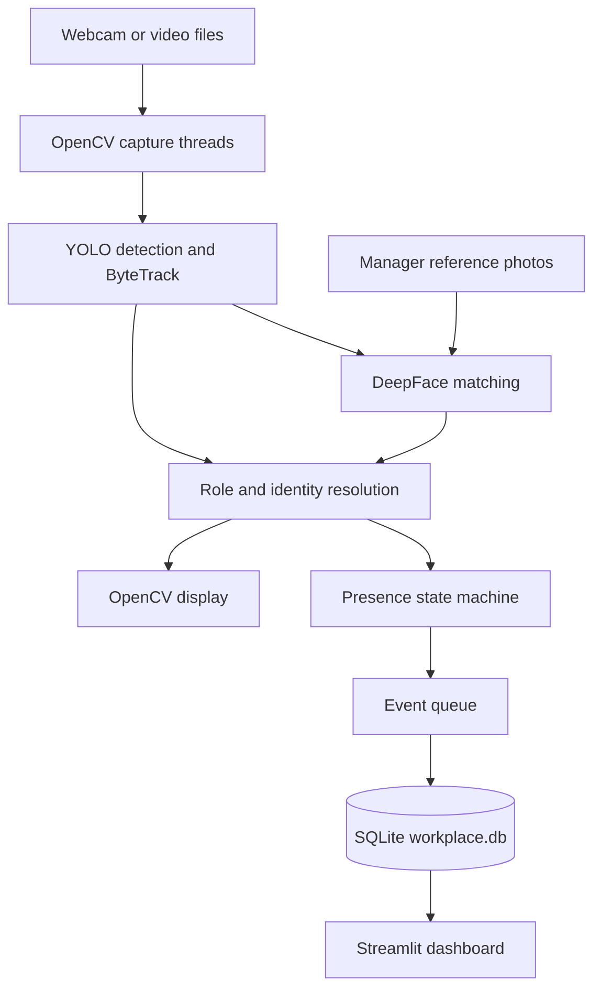

# WPMS · Workplace Monitoring System

A computer vision prototype that turns camera detections into manager-presence sessions. WPMS connects YOLO detection and ByteTrack tracking to a small state machine, SQLite event storage, and a Streamlit dashboard.

The project explores the full path from video inference to reviewable session records. Presence means visibility in a camera feed; configurable floor zones and physical entry/exit boundaries are not implemented.

## What it does

- Reads webcam or video-file sources with OpenCV and runs a YOLO model with ByteTrack IDs.
- Interprets model class names as manager/worker roles and can match manager reference photos through DeepFace.
- Confirms manager tracks after a configurable observation threshold and waits five seconds after the last observation before recording an exit.
- Queues database writes separately from capture, inference, and display work.
- Stores track ID, camera ID, role, entry time, and exit time in a local SQLite database.
- Displays active sessions, daily entry counts, average session duration, and filterable historical records in Streamlit.

## Architecture



Each source has its own inference and tracking state. The database groups sessions by track ID and camera ID; it does not establish a persistent identity across cameras.

## Setup

- Python 3.10 or newer, as declared in `pyproject.toml`, and a desktop environment for the OpenCV windows.
- A webcam or local video file. Example videos, training data, and manager reference photos are not included.
- The dependency configuration targets PyTorch CUDA 12.8 wheels. CUDA inference requires a compatible NVIDIA GPU and driver; the monitor selects CPU if CUDA is unavailable. Other platforms may require changing the package source configuration.

```bash
git clone https://github.com/RAMZI0TO99/WPMS.git
cd WPMS
uv sync
```

The repository includes `uv.lock`. Alternatively, create a virtual environment and install `requirements.txt`; its extra package index also points to the CUDA 12.8 wheel repository.

Run commands from the repository root. The examples below use the direct monitor entry point, which selects the included custom checkpoint by default.

## Run a local example

### 1. Start detection and tracking

```bash
# Default webcam, using the included custom checkpoint
uv run python src/monitor.py --source 0

# A local video file you have placed in videos/
uv run python src/monitor.py --source videos/example.mp4

# Two sources in one process
uv run python src/monitor.py --source videos/camera_a.mp4 videos/camera_b.mp4
```

The file paths above are examples to replace with your own inputs. Press **q** in the OpenCV window to stop the monitor.

| Argument | Default | Purpose |
|---|---|---|
| `--source` | `0` | One or more webcam indexes or video paths |
| `--model` | `runs/detect/train-4/weights/best.pt` | YOLO checkpoint; falls back to `yolov8n.pt` if the custom file is absent |
| `--conf` | `0.75` | Detection confidence threshold |
| `--min-frames` | `3` | Manager observations required before an entry is recorded |

The separate `main.py` interactive launcher has different defaults and a sibling-module import issue in the current source. Use `src/monitor.py` for the workflow above.

### 2. Add optional name matching

Place manager reference photos in `known_managers/` at the project root, using the intended display name as the filename, such as `ExamplePerson.jpg`. Supported extensions are `.jpg`, `.jpeg`, `.png`, and `.webp`.

The monitor creates the directory if absent. Without photos, a manager-class detection can still be logged as `Manager (Unknown)`. With generic `yolov8n.pt`, role identification instead depends on face matches. DeepFace may download its model weights on first use.

Use photos and video authorized for this demonstration. `known_managers/` is not currently excluded by `.gitignore`; keep personal photos and generated face indexes out of commits.

### 3. Review sessions

In a second terminal:

```bash
uv run streamlit run src/dashboard.py
```

Open the local URL printed by Streamlit, normally **http://localhost:8501**. Start the monitor first to create `workplace.db` and its event table.

The dashboard reads the database at the repository root and provides camera/role filters. Its data cache expires after two seconds, but it has no automatic rerun loop; refresh or interact with the page to request updated data.

## Model provenance and training

The repository contains a custom checkpoint at [runs/detect/train-4/weights/best.pt](runs/detect/train-4/weights/best.pt). The monitor expects class names containing manager-related terms (`manager`, `vest`, `supervisor`, `foreman`) or worker-related terms. The supplied [training script](src/training/train.py) fine-tunes Ultralytics `yolov8n.pt` on a YOLO-format dataset.

The checkpoint's training dataset, class distribution, training logs, and evaluation metrics are not included. Its accuracy and suitability for other cameras or workplaces have not been established by published evidence in this repository.

To train with your own dataset:

```bash
uv run python src/training/train.py --data dataset/data.yaml --epochs 50 --imgsz 640
```

This script **rewrites the supplied `data.yaml`** to use its directory as the dataset root and `train/images`, `valid/images`, and `test/images` as the splits. Use a working copy with that layout. Training hard-codes `device=0`, `batch=8`, and `workers=0`, so it requires a CUDA GPU. Pass the resulting checkpoint to the monitor with `--model`.

An optional [TensorRT export helper](src/export_engine.py) is included; it requires a separately prepared CUDA/TensorRT environment. No export or inference speedup is claimed here.

## Implementation evidence

| Area | Source |
|---|---|
| Capture, tracking, role resolution, and display | [monitor.py](src/monitor.py) |
| Reference-photo matching | [face_id.py](src/face_id.py) |
| Entry/exit state | [tracker_state.py](src/tracker_state.py) |
| SQLite event persistence | [database.py](src/database.py) |
| Session reporting | [dashboard.py](src/dashboard.py) |

## Limitations and validation

- Timestamps use processing wall-clock time. Capture keeps recent frames and may skip intermediate frames, so recorded-video session durations do not represent the source video's timeline.
- Pending observations are counted without resetting on missed frames. `--min-frames` is therefore not a strict consecutive-frame guarantee.
- The database merges a returning track's session when its previous exit was less than 60 seconds ago. Tracker ID changes or reuse can split or merge sessions incorrectly.
- On startup, previously open sessions are closed with their entry time as the exit time. These records are cleanup artifacts rather than measured attendance durations.
- Detection, face matching, occlusion handling, and tracking need evaluation on the intended camera conditions. There is no committed automated test suite, sample dataset, or published accuracy/latency benchmark.
- These instructions reflect the source and manifests. A full installation, webcam run, training run, and dashboard session have not been independently validated as part of the documentation update.
